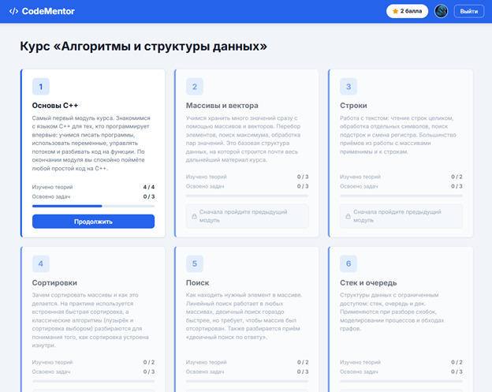
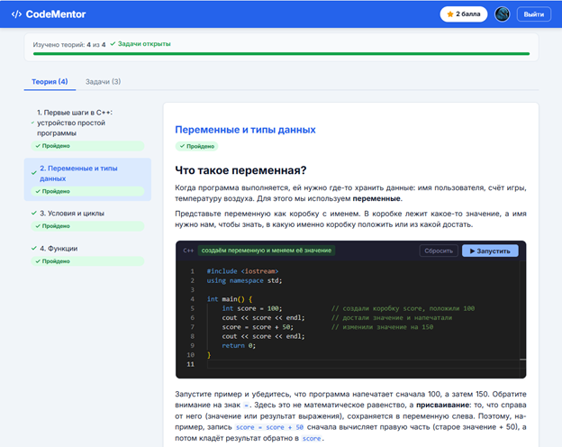
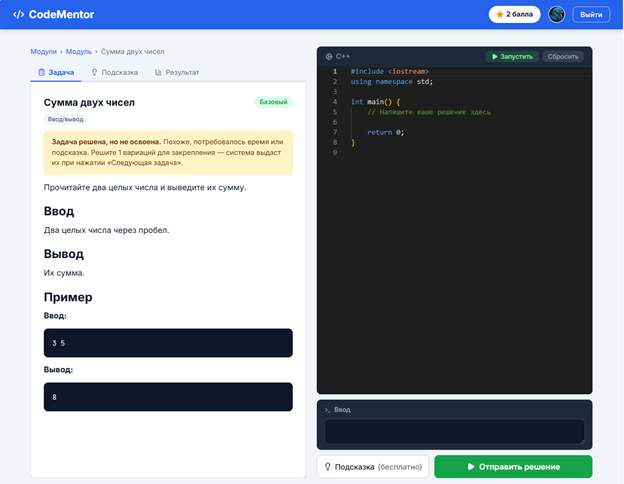
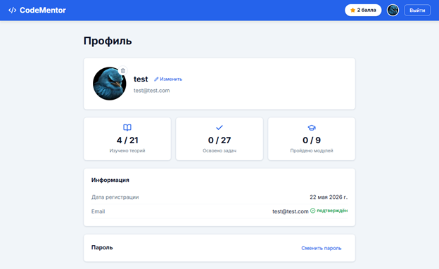

# CodeMentor

Адаптивная образовательная платформа для изучения алгоритмов и структур данных на языке C++ с использованием технологий искусственного интеллекта.

Проект разработан в качестве выпускной квалификационной работы по направлению «Программная инженерия».

## О проекте

CodeMentor помогает студентам изучать программирование через сочетание теории, практических заданий и интеллектуальной системы подсказок.

Платформа предоставляет:

* теоретические материалы по алгоритмам и структурам данных;
* интерактивные блоки с исполняемым кодом;
* задания на программирование;
* автоматическую проверку решений;
* адаптивный подбор задач в зависимости от прогресса пользователя;
* систему баллов и достижений;
* ИИ-ассистента, который помогает решать задачи с использованием подхода Scaffolding (направляющие подсказки без выдачи готового решения).

## Основные возможности

### Авторизация и профиль пользователя

* регистрация и авторизация пользователей;
* личный кабинет;
* отслеживание прогресса обучения;
* накопление баллов за прохождение материалов и решение задач.

### Теоретические модули

* структурированные учебные материалы;
* встроенные примеры кода;
* интерактивные мини-задания;
* тесты для проверки знаний.

### Практика программирования

* решение задач по алгоритмам и структурам данных;
* выполнение и проверка C++ кода;
* автоматическое тестирование решений;
* ограничение времени выполнения программ.

### Адаптивное обучение

Система анализирует результаты пользователя и подбирает дальнейшие задания с учетом уровня освоения тем.

### ИИ-ассистент

Пользователь может получать подсказки за накопленные баллы.

ИИ-ассистент:

* анализирует текущее решение;
* помогает найти ошибку;
* направляет к правильному подходу;
* не предоставляет готовый ответ.

## Технологический стек

### Backend

* Python
* Django
* Django REST Framework
* PostgreSQL
* JWT Authentication

### Frontend

* React
* Vite
* Axios
* Monaco Editor

### Искусственный интеллект

* Groq API
* Llama 3.3 70B

## Архитектура

Frontend (React)

↓

REST API

↓

Backend (Django REST Framework)

↓

PostgreSQL

Дополнительно:

Frontend/Backend ↔ AI Assistant (Groq API)

## Скриншоты

### Главная страница



### Теоретический материал



### Практическое задание



### Профиль пользователя



## Запуск проекта

### Backend

```bash
cd backend

python -m venv venv
pip install -r requirements.txt

python manage.py migrate
python manage.py runserver
```

### Frontend

```bash
cd frontend

npm install
npm run dev
```

## Конфигурация

Перед запуском необходимо создать файл `.env` на основе шаблона:

```text
backend/.env.example
```

и указать:

* SECRET_KEY
* параметры подключения PostgreSQL
* ключ доступа к Groq API

## Автор

Анжелика Еременко

РТУ МИРЭА

Направление подготовки: «Программная инженерия»

Выпускная квалификационная работа, 2025–2026 г.
